# LAB06-ARSW-TERRAFORM Infraestructura como Código con Terraform (Azure)
**Realizado por:** David Alejandro Patacon Henao 

## Desarrollo del laboratorio

### Backend remoto de Terraform

Despues de haber creado el ```resourse group```, el ```storage account``` y el ```container``` en el portal de Azure para el backend remoto de Terraform, se procedió a crear el archivo `backend.hcl` con la siguiente configuración:

```hcl
resource_group_name = "rg-tfstate-lab6"
storage_account_name = "sttfstate12345678"
container_name = "tfstate"
key = "lab6.terraform.tfstate"
```
- **resource_group_name:** grupo de recursos del backend
- **storage_account_name:** nombre de la cuenta de almacenamiento
- **container_name:** contenedor del state
- **key:** nombre del archivo de state

---

### Configurar el provider de Azure
Luego se creó el archivo `providers.tf` con la siguiente configuración para el provider de Azure:

```tf
terraform {
  required_version = ">= 1.6.0"
  required_providers {
    azurerm = {
      source  = "hashicorp/azurerm"
      version = "~> 4.0"
    }
  }
  backend "azurerm" {}
}
provider "azurerm" {
  features {}
}
```
- **required_version:** obliga a usar una versión compatible de Terraform
- **required_providers:** define el proveedor de Azure
- **backend "azurerm" {}:** indica que el state vivirá en Azure Storage
- **provider "azurerm" { features {} }:** activa el proveedor de Azure

---

### Definir variables
En el archivo `variables.tf` se definieron las siguientes variables:

```tf
variable "prefix" {
  description = "Prefijo para nombrar recursos"
  type        = string
}

variable "location" {
  description = "Región de Azure"
  type        = string
}

variable "vm_count" {
  description = "Número de VMs"
  type        = number
  default     = 2
}

variable "admin_username" {
  description = "Usuario administrador"
  type        = string
}

variable "ssh_public_key" {
  description = "Ruta a la clave pública SSH"
  type        = string
}

variable "allow_ssh_from_cidr" {
  description = "CIDR permitido para SSH"
  type        = string
}

variable "tags" {
  description = "Etiquetas comunes"
  type        = map(string)
  default     = {}
}
```
- **prefix:** prefijo común de nombres
- **location:** región
- **vm_count:** cantidad de máquinas virtuales
- **admin_username:** usuario Linux
- **ssh_public_key:** archivo de clave pública
- **allow_ssh_from_cidr:** IP pública en formato /32
- **tags:** metadatos de los recursos

---

### Variables de entorno
En el archivo `env/dev.tfvars` se asignaron valores a las variables:
```hcl
prefix              = "lab6"
location            = "centralus"
vm_count            = 2
admin_username      = "student"
ssh_public_key      = "~/.ssh/id_ed25519.pub"
allow_ssh_from_cidr = "186.28.26.89/32"

tags = {
  owner   = "AlejandroHenao2572"
  course  = "ARSW"
  env     = "dev"
  expires = "2026-12-31"
}
```
Este archivo contiene valores concretos para el entorno de desarrollo.

---

### Archivo cloud-init
El archivo `cloud-init.yaml` se creó con el siguiente contenido para configurar las VMs

```yaml
#cloud-config
package_update: true
packages:
  - nginx
runcmd:
  - echo "Hola desde $(hostname)" > /var/www/html/index.nginx-debian.html
  - systemctl enable nginx
  - systemctl restart nginx
```
- **#cloud-config:** indica que es un archivo cloud-init
- **package_update:** true: actualiza la lista de paquetes
- **packages:** - nginx: instala nginx
- **runcmd:** comandos que se ejecutan al iniciar la VM
- **echo "Hola desde $(hostname)" ...:** crea una página web con el nombre del host
- **systemctl enable nginx:** habilita nginx al arranque
- **systemctl restart nginx:** reinicia nginx para aplicar cambios

### Ejecución de Terraform

Para ejecutar Terraform, se siguieron los siguientes pasos:

Inicialización del backend remoto:
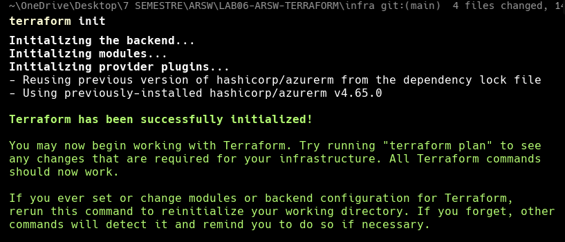

Revision rapida:
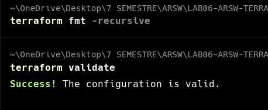

Ejecución del plan:
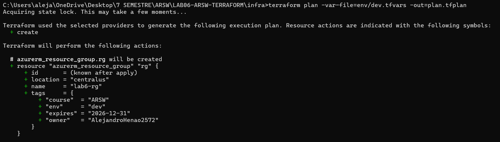

Aplicación del plan:
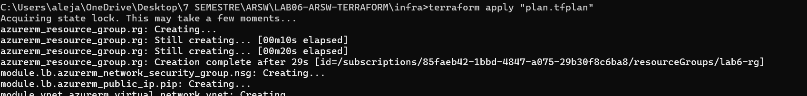
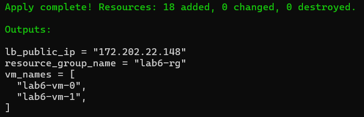

Output de Terraform:

```txt
lb_public_ip = "172.202.22.148"
resource_group_name = "lab6-rg"
vm_names = [
  "lab6-vm-0",
  "lab6-vm-1",
]
```

Entrar a la IP pública del Load Balancer desde el navegador:  

> **IP pública del Load Balancer:** http://172.202.22.148

- Respuesta de la VM 0:
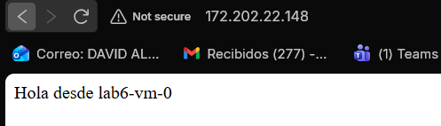

- Respuesta de la VM 1:
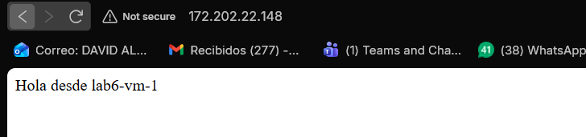

- Pruebas con curl:
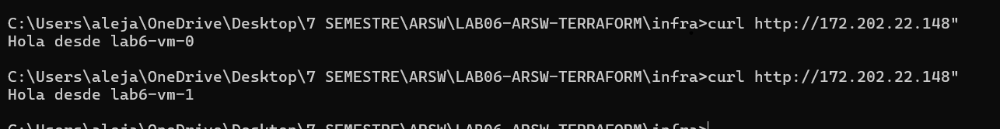


## Workflow CI/CD con GitHub Actions

Se implementó el workflow `.github/workflows/terraform.yml` para automatizar la validación y despliegue de la infraestructura con Terraform.

Este workflow tiene dos ejecuciones principales:

- **Pull Request hacia `main`**: ejecuta `terraform fmt`, `terraform validate` y `terraform plan`.
- **Ejecución manual (`workflow_dispatch`)**: ejecuta `terraform apply` para aplicar los cambios en Azure.

### Funcionamiento general
- Usa **OIDC** para autenticarse en Azure sin credenciales largas.
- Toma como base el directorio `./infra`.
- Inicializa Terraform con el backend remoto en Azure Storage.
- Crea la llave pública SSH requerida por la infraestructura.
- Publica el archivo del plan como artefacto en el pipeline.

### Resultado
Con este flujo, cada cambio en Terraform se revisa antes de llegar a `main`, y el despliegue final se realiza de forma controlada y manual.

### Evidencias del workflows

Se creo una rama para testear el workflow y se hizo un PR a main para validar su funcionamiento.

Terraform Plan:

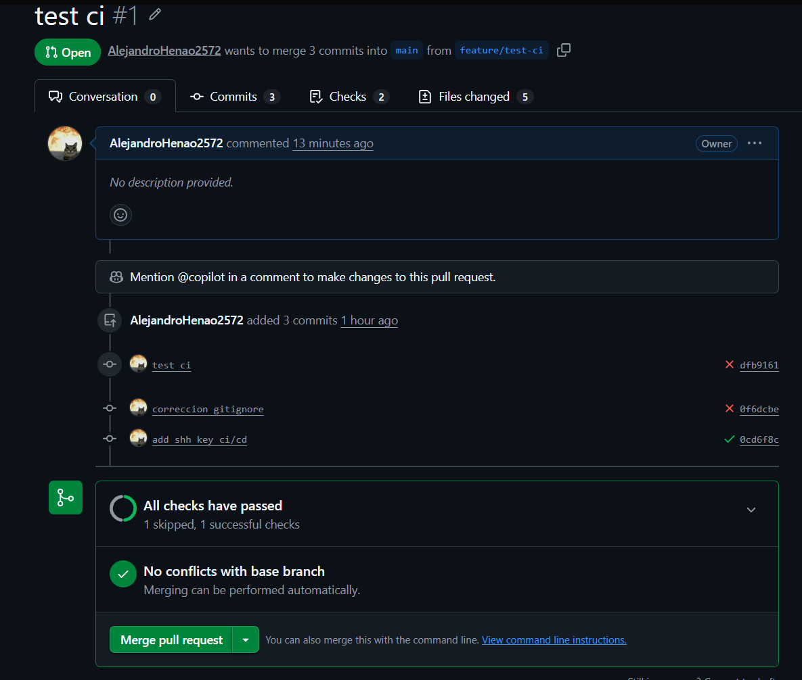  
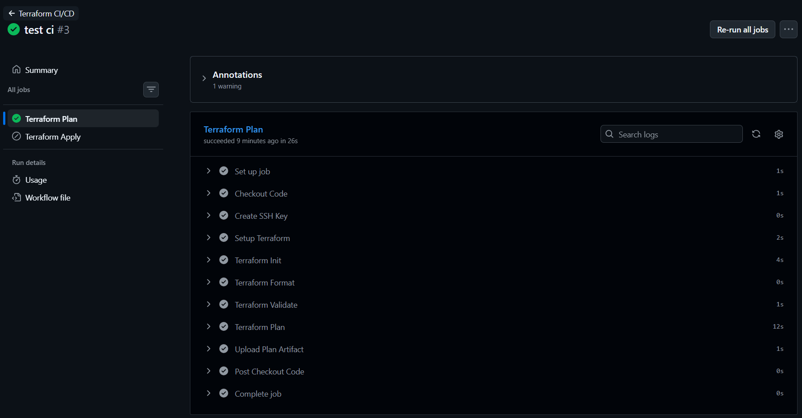

Terraform Apply:
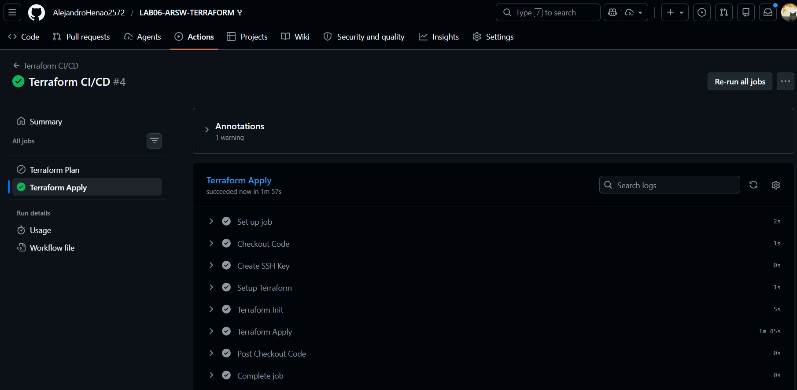

## Diagrama Componentes


Este diagrama muestra la estructura del sistema. Se divide en tres zonas principales:

- **El ecosistema de GitHub:** Donde reside el código y se ejecuta el pipeline (GitHub Actions).  

- **El plano de control/Backends en Azure:** Donde ocurre la autenticación (OIDC a través de Entra ID) y donde se guarda el estado de Terraform (Storage Account).  

- **La Infraestructura Desplegada:** Los recursos reales creados en el Resource Group, mostrando el balanceador de carga público, las reglas de red (NSG) y las dos máquinas virtuales con Nginx en la subred web.

## Diagrama de Secuencia
  

Este diagrama ilustra el comportamiento paso a paso del flujo de trabajo de Infraestructura como Código (IaC). Muestra cómo un cambio en el código viaja desde tu máquina local hasta convertirse en recursos en la nube. Destaca fases clave del laboratorio:

- **Fase de Planificación (PR):** Validación y lectura del estado para saber qué va a cambiar.

- **Fase de Despliegue (Apply manual):** Autenticación OIDC, bloqueo del estado para evitar colisiones y creación de los recursos a través del Azure Resource Manager (ARM).

- **Fase de Inicialización:** Ejecución del cloud-init dentro de las VMs.

## Preguntas de reflexión
- **¿Por qué L4 LB vs Application Gateway (L7) en tu caso? ¿Qué cambiaría?:**  

En este laboratorio usamos un Load Balancer L4 por su simplicidad, bajo costo y eficiencia para distribuir tráfico TCP básico (puerto 80) hacia nuestras páginas estáticas. Si cambiáramos a un Application Gateway (L7), ganaríamos capacidades avanzadas como enrutamiento inteligente basado en URL, terminación SSL/HTTPS y protección contra ataques web mediante un WAF (Web Application Firewall), aunque esto aumentaría notablemente la complejidad y los costos de la infraestructura.

- **¿Qué implicaciones de seguridad tiene exponer 22/TCP? ¿Cómo mitigarlas?**  

Exponer el puerto 22 a Internet hace que las máquinas virtuales sean un blanco fácil para escaneos automatizados y ataques de fuerza bruta. Para mitigar estos riesgos en el laboratorio, implementamos restricciones estrictas en el NSG para permitir el acceso SSH únicamente desde nuestra IP pública personal, pero en un entorno real la mejor práctica es eliminar por completo las IPs públicas de las VMs y utilizar servicios nativos como Azure Bastion o acceso Just-In-Time (JIT).

- **¿Qué mejoras harías si esto fuera producción? (resiliencia, autoscaling, observabilidad).**

Para llevar esta arquitectura a producción, reemplazaría las VMs estáticas por un Virtual Machine Scale Set (VMSS) distribuido en múltiples zonas de disponibilidad, permitiendo que la infraestructura escale automáticamente (autoscaling) según la demanda de CPU o tráfico. Además, mejoraría la observabilidad integrando Azure Monitor y Log Analytics para centralizar métricas y alertas, y fortalecería la seguridad integrando un Application Gateway con WAF y herramientas de análisis estático de código en el pipeline de GitHub Actions. Tambien Manejaría múltiples entornos (Dev, QA, Prod) usando Terraform Workspaces o carpetas separadas para aislar los estados. Por utltimo Crearía Alertas para notificar por correo o webhook si el Health Probe del Load Balancer falla o si el consumo de presupuesto (Budgets) se acerca al límite.

## Reflexion tecnica

### Decisiones Arquitectónicas y de Diseño

Durante el desarrollo de este laboratorio, la infraestructura se modeló bajo el paradigma de Infraestructura como Código (IaC) priorizando la automatización, la seguridad y la reproducibilidad:

- **Gestión del Estado (Remote State):** Se optó por almacenar el archivo terraform.tfstate en un Azure Storage Account. Esta decisión centraliza la fuente de verdad, habilita el bloqueo del estado (state locking) para evitar corrupciones por ejecuciones concurrentes y es fundamental para integrar CI/CD de manera segura.

- **Autenticación sin Secretos (OIDC):** Para el pipeline en GitHub Actions, se configuró una federación de identidad (OpenID Connect) con Microsoft Entra ID. Esto eliminó la necesidad de almacenar credenciales estáticas de larga duración (como un Client Secret), reduciendo drásticamente la superficie de ataque en caso de que el repositorio sea comprometido.

- **Configuración inmutable:** Se utilizó cloud-init para la instalación y configuración de Nginx. Esto garantiza que las máquinas virtuales nacen completamente funcionales sin requerir intervención manual o scripts post-despliegue a través de SSH.

### Trade-offs 

En la arquitectura propuesta, se tomaron decisiones que implicaron balancear beneficios frente a costos y complejidad:

- **Load Balancer (L4) vs. Application Gateway (L7):** Se eligió el balanceador de capa 4 por su simplicidad y bajo costo, ideal para este escenario académico donde solo servimos contenido estático (HTTP/80). El trade-off es la pérdida de capacidades avanzadas de capa 7 (enrutamiento por URL, descarga SSL y Web Application Firewall).

- **VMs Estáticas vs. VM Scale Sets (VMSS):** Se desplegaron dos máquinas virtuales independientes. Aunque esto cumple con el requisito de alta disponibilidad básica, sacrificamos la elasticidad automática (escalado horizontal dinámico) y la auto-reparación que ofrecería un clúster de VMSS.

- **Acceso SSH Directo vs. Azure Bastion:** Para facilitar la depuración, se mantuvo el puerto 22 abierto, mitigando el riesgo al restringirlo a una única IP pública (la del estudiante) mediante el NSG. El trade-off fue ahorrar los altos costos asociados a desplegar Azure Bastion (aprox. $130 USD/mes), a cambio de asumir el riesgo residual de exponer IPs públicas en las VMs.


### Estimación de Costos Aproximados
Asumiendo un despliegue continuo (24/7) en la región centralus o eastus con recursos estándar para laboratorios , el costo estimado mensual sería:

- 2 Máquinas Virtuales (ej. Standard_B1s): ~$15.00 USD
- Discos OS (Premium SSD 30GB x2): ~$10.00 USD
- Load Balancer (SKU Standard) + Reglas: ~$18.00 USD
- Direcciones IP Públicas (LB y VMs si aplican): ~$8.00 USD
- Storage Account (Backend tfstate): < $1.00 USD
- Costo Total Estimado: ~$52.00 USD mensuales 

> Nota: Al tratarse de un entorno de pruebas, los recursos solo deben existir durante la ejecución del laboratorio para minimizar el consumo de los créditos de Azure for Students.

## Estrategia de Destrucción Segura
Para evitar cobros inesperados y asegurar que no queden recursos huérfanos, el proceso de destrucción se realiza de la siguiente manera:

- **Destrucción vía Terraform**: Ejecutar localmente el comando terraform destroy -var-file=env/dev.tfvars -auto-approve 

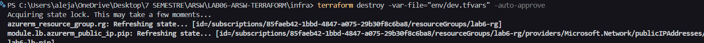  
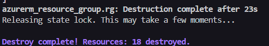

- **Validación en el Portal**: Verificar en Azure Portal que el grupo de recursos principal esté completamente vacío o eliminado.
